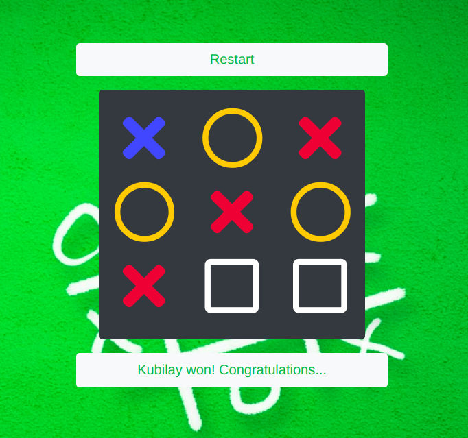

# Tic Tac Tow

> You can play Tic-Tac-Toe with this application. My purpose was to only build it with Javascript. There are no global variables. Almost every method is single responsible. 

### How To Remove Event Listeners?

> I am storing event listeners in an array at the moment of creation.
> When I want to remove them, I am using that array to address them.

### 

## Built With

- HTML, 
- CSS,
- JAVASCRIPT,
- BOOTSTRAP,
- SASS

## Live Demo

[Live Demo Link](https://rawcdn.githack.com/kubilaycaglayan/tic-tac-toe-js/fcac74cfe0a3afc07899fbc84834747b63b76b7b/tictactoe.html)

## Getting Started

### Usage

- Click the Live Demo link and enjoy my website.

### Prerequisites

- A modern browser, up to date.

### Run tests

- There is no automated tests for this project.

## Author

👤 **Kubilay Caglayan**

- Website: [kubilay](https://kubilaycaglayan.com)
- Github: [@kubilaycaglayan](https://github.com/kubilaycaglayan)
- Twitter: [@kbcaglayan](https://twitter.com/kbcaglayan)
- Linkedin: [linkedin](https://linkedin.com/in/kubilaycaglayan)

## 🤝 Contributing

Contributions, issues and feature requests are welcome!

Feel free to check the [issues page](https://github.com/kubilaycaglayan/library/issues).

## Show your support

Give a ⭐️ if you like this project!

## Acknowledgments

- https://www.theodinproject.com/courses/javascript/lessons/library

## 📝 License

This project is [MIT](LICENCSE) licensed.
